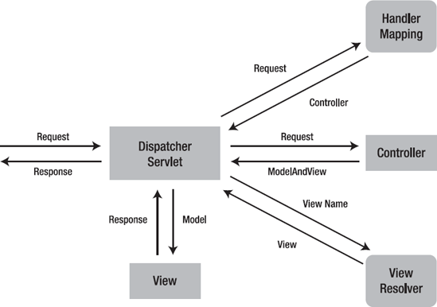

# Spring-Study

## 목차

- # 목차
      	- [수행 순서](#수행-순서)
      	- [결합도](#결합도)
      	- [빈](#빈)
      	- [의존 주입](#의존-주입)
      	- [어노테이션](#Annotation)
      	- [DB세팅](#데이터베이스-연결)
      	- [컨트롤러설정](#컨트롤러)
      	- [참고 자료](#참고-자료)

## 수행 순서

1. encoding 설정

- window > prefer... > encoding 검색 > utf-8로 변경
- xml 수정

  ```
  <!-- 캐릭터 인코딩 필터 설정  -->
  <!-- 컨트롤러에서 response.setCharacterEncoding()를매번 실행하지 않기 위해 서블릿 필터를 이용해 처리  -->
  <filter>

  	<filter-name>encodingFilter</filter-name>

  	<filter-class>org.springframework.web.filter.CharacterEncodingFilter</filter-class>

  	<init-param>

  		<param-name>encoding</param-name>

  		<param-value>UTF-8</param-value>

  	</init-param>

  	<init-param>

  		<param-name>forceEncoding</param-name>

  		<param-value>true</param-value>

  	</init-param>
  </filter>
  <filter-mapping>

  	<filter-name>encodingFilter</filter-name>

  	<url-pattern>/*</url-pattern>
  </filter-mapping>
   <!-- jsp 파일 utf-8 페이지 인코딩 설정 <%@ page pageEncoding="UTF-8" %>  -->
  <jsp-config>

  	<jsp-property-group>

  		<url-pattern>*.jsp</url-pattern>

  		<page-encoding>UTF-8</page-encoding>

  	</jsp-property-group>
  </jsp-config>

  ```

2. 톰캣 서버 연동
3. pom.xml 버전 체크

   - 자바버전 1.8
   - 스프링프레임워크 5.0.7
   - junit 4.12
   - maven 플러그인 1.8

4. maven 디펜던시 추가 안될때 Window - Preferences - Maven > 다운로드 관련 다 체크
5. [db테스트를 위한 sql 생성](./src/main/resources/springbook.sql)

## 결합도

- [TVUser.java](./src/main/java/polymorphism/TVUser.java)

## 빈

1. 리소스 영역에 [application.xml](./src/main/resources/applicationContext.xml) 생성후 빈 추가

2. [TVUser](./src/main/java/polymorphism/TVUser.java) 파일에서 빈 팩토리 호출해서 사용 기본적으로 싱글톤 패턴으로 사용됨

- 번외: 싱글톤패턴 사용하기 싫을때 [application.xml](./src/main/resources/applicationContext.xml)
  `scope="prototype"` 스코프 속성을 사용해 바꿀수 있음

## 의존 주입

---

1.생성자의 의한 주입.

```
<bean id="samsungTV" class="polymorphism.SamsungTV" ><!-- scope="prototype" -->
		<constructor-arg ref="apple"></constructor-arg>
		<constructor-arg value="270000"></constructor-arg>
</bean>
```

---

2.세터 메소드의 의한 주입

```
<bean id="samsungTV" class="polymorphism.SamsungTV" ><!-- scope="prototype" -->
		<property name="speaker" ref="apple"></property>
		<property name="price" value="270000"></property>
</bean>
```

---

3.멤버변수의 의한 주입

#### 배열 (list,map,set,propertie ...)

#### List

```
<bean id="collectionBean"
		class="com.springbook.ioc.injection.CollectionBean">
		<property name="addressList">
			<list>
				<value>서울시 강남구</value>
				<value>서울시 영등포구</value>
			</list>
		</property>
</bean>
```

###### 값을 가져올때

```
AbstractApplicationContext factory = new GenericXmlApplicationContext("applicationContext.xml");

CollectionBean bean = (CollectionBean)factory.getBean("collectionBean");
List<String> addressList = bean.getAddressList();

for(String address : addressList) {
	System.out.println(address);
}

서울시 강남구
서울시 영등포구 반환
```

---

#### Set

```
<bean id="collectionBean"
	class="com.springbook.ioc.injection.CollectionBean">
	<property name="addressList">
		<set value-type="java.lang.String">
			<value>서울시 강남구</value>
			<value>서울시 영등포구</value>
			<value>서울시 영등포구</value>
		</set>
	</property>
</bean>
```

##### 값을 가져올때

```
AbstractApplicationContext factory = new GenericXmlApplicationContext("applicationContext.xml");

CollectionBean bean = (CollectionBean)factory.getBean("collectionBean");
Set<String> addressList = bean.getAddressList();

for(String address : addressList) {
	System.out.println(address);
}
```

---

#### Map

```
<bean id="collectionBean"
	class="com.springbook.ioc.injection.CollectionBean">
	<property name="addressList">
		<map>
			<entry>
				<key><value>고길동</value></key>
				<value>서울시 강남구</value>
			</entry>
			<entry>
				<key><value>홍길동</value></key>
				<value>서울시 영등포구</value>
			</entry>
		</map>
	</property>
</bean>
```

##### 값을 가져올때

```
AbstractApplicationContext factory = new GenericXmlApplicationContext("applicationContext.xml");

CollectionBean bean = (CollectionBean)factory.getBean("collectionBean");
Map<String,String> addressList = bean.getAddressList();

Iterator<String> keys = addressList.keySet().iterator();
while( keys.hasNext() ){
	String key = keys.next();
	System.out.println( String.format("키 : %s, 값 : %s", key, addressList.get(key)) );
}

```

---

#### Properties

```
<bean id="collectionBean"
	class="com.springbook.ioc.injection.CollectionBean">
	<property name="addressList">

		<props>
			<prop key="고길동">서울시 강남구</prop>
			<prop key="홍길동">서울시 영등포구</prop>
		</props>
	</property>
</bean>
```

##### 값을 가져올때

```
AbstractApplicationContext factory = new GenericXmlApplicationContext("applicationContext.xml");

CollectionBean bean = (CollectionBean)factory.getBean("collectionBean");
Properties addressList = bean.getAddressList();
for(String key : addressList.stringPropertyNames()) {
	System.out.println(String.format("키: %s / 값 : %s", key,addressList.get(key)));
}
```

---

### Annotation

##### 빈 등록 어노테이션

> @Component
>
> ```
> <context:component-scan base-package="패키지명(polymorphism)"></context:component-scan>
> --패키지명에 기입된 파일들을 빈으로 등록해준다.
>
> 연결해줄 클래스 상단에 작성
> @Component("이름")
>
> 사용할 클래스에서 불러와서 사용
> AbstractApplicationContext factory = new GenericXmlApplicationContext("applicationContext.xml");
> 객체 name = (객체)factory.getBean("이름");
>
> ```

##### 의존주입 어노테이션

> ##### @AutoWired
>
> 타입이 일치하는 빈을 찾아서 자동주입한다.
> 2개이상의 클래스가 존재할 경우 @Qualifier를 사용한다.
> @QualiFier("이름")
>
> ```
> @Autowired
> @Qualifier("apple")
>
> **직접 개발한 클래스**는 어노테이션을 사용할수 있고, XML 설정을 할 수 있다.
> 하지만 **라이브러리 형태**로 제공되는 클래스는 반드시 XML설정을 통해서 사용해야 한다.(어노테이션 사용 불가)
> ```

#### AOP어노테이셔 표기법

@Pointcut

@Before , After , Around

```
<aop:aspectj-autoproxy></aop:aspectj-autoproxy>  // 빈을 생성하는 XML단에 AOP어노테이션 사용을위한 빈 자동생성 태그

@Service -> 빈객체 생성 어노테이션
@Aspect //포인트컷 + Advice 선언 어노테이션
public class LogAdvice {
	@Pointcut("execution(* com.springbook.biz..*Impl.*(..))") //포인트컷(대상지정 어노테이션)
	public void allPointcut() {}  //포인트컷으 사용하기위한 메소드

	@Before("allPointcut()")  //Before 대상 수행전사용되는 메소드
	public void printLog() {

		System.out.println("[공통 로그] 비즈니스 로직 수행 전 동작");
	}
}

	- AfterReturning 을 사용할때에는
		@AfterReturning(pointcut="경로지정대상",returning="매개변수")
```

## 데이터베이스 연결

### Commons DBCP (Maven JDBC Pools 사용)

스프링에서 지원하는 JdbcTemplate 클래스

- 새로운 기능의 메소드를 개발하려면 결국 기존의 메소드를 복사하여 SQL만 수정하는 방법 뿐임

- 스프링은 JDBC 기반의 DB 연동 프로그램을 쉽게 개발할 수 있도록 JdbcTemplate 클래스를 지원함 - 지원하는 메소드 - update() => insert, update, delete - queryForInt(), queryForObject(), query() => select 위해 사용 - 

```
Object[] args = {vo.getSeq()};
 return jdbcTemplate.queryForObject(쿼리문 변수, args, new BoardRowmapper()); SQL 쿼리문 넣어주기 / args->?값 전달, RowMapper를 통한 값리턴

public class BoardRowMapper implements RowMapper<BoardVO> {

@Override
public BoardVO mapRow(ResultSet rs, int rowNum) throws SQLException {
	BoardVO bVo = new BoardVO();
	bVo.setSeq(rs.getInt("seq"));
	bVo.setTitle(rs.getString("title"));
	bVo.setWriter(rs.getString("writer"));
	bVo.setContent(rs.getString("content"));
	bVo.setRegdate(rs.getDate("regdate"));
	bVo.setCnt(rs.getInt("cnt"));

	return bVo;
}}

RowMapper를 상속받는 클래스 생성 후 RowMapper 정의해주기.
```

JDBC Template 빈 생성

```
<bean id="jdbcTemplate" class="org.springframwork.jdb.core.JdbcTemplate"></bean>

<bean id="jdbcTemplate"
		class="org.springframework.jdbc.core.JdbcTemplate.class">
		<property name="dataSource" ref="dataSource"></property>
</bean>
```

database.properties 파일 생성(key,value값으로 저장)

```
jdbc.driver = oracle.jdbc.driver.OracleDriver (Oracle 드라이버정보)
jdbc.url = jdbc:oracle:thin:@HYEONM1339_medium?TNS_ADMIN=./Wallet_HYEONM1339  (OracleCloud 관련주소)
jdbc.username = 아이디
jdbc.paswword = 비밀번호
```

빈생성

```
<context:property-placeholder location="classpath:config/database.properties"/>  // (config폴더안에잇는 데이터베이스파일)
<bean id="dataSource" class="org.apache.commons.dbcp.BasicDataSource" destroy-method="close">
		<property name="driverClassName" value="${jdbc.driver}"></property>
		<property name="url" value="${jdbc.url}"></property>
		<property name="username" value="${jdbc.username}"></property>
		<property name="password" value="${jdbc.password}"></property>
</bean>
database.properties파일의 key값을 각 name에맞게 세터주입시켜줌.(데이터베이스 연결정보 전달)
```

---

> Build Path-> configure Build Path -> Library/Add External JARS -> 필요한JAR파일 열기 -> Deployment Assembly -> ADD -> JAVA Build Path Entries -> 파일추가하기

### 컨트롤러

- 디스패처서블릿이(프론트컨트롤러) 요청을 받아 핸들러와 정보를 주고받고, 그정보를 토대로 컨트롤러와 다시 연결 후 최종적으로 뷰를 실행한다.
  

- 핸들러매핑 생성

```
public class HandlerMapping {
	private Map<String,Controller> mappings;

	public HandlerMapping() {
		mappings = new HashMap<String, Controller>();	//키,밸류값을 갖는 해쉬맵객체를 문자열,컨트롤러를 타입으로 생성
		mappings.put("/loing.do", new LoginController());  //login.do요청이 들어올때 그에맞는 로그인컨트롤러 객체를 생성
	}

	public Controller getController(String path) {
		return mappings.get(path);					//미리 만들어둔 키밸류값에 path값 [경로 ex)login.do]을 넘겨주어 원하는 밸류(LoginController()를 반환
	}

}
```

- DispatcherServlet에 핸들러매핑 등록

```
public class DispatcherServlet extends HttpServlet {
	private static final long serialVersionUID = 1L;
	private HandlerMapping handlerMapping;		//핸들러 맵핑 객체 생성

public void init() throws ServletException{		//초기화 메서드 작성
	handlerMapping = new HandlerMapping();
}
```

- interface 생성

```
public class LoginController implements Controller {

@Override
public String HandleRequest(HttpServletRequest request, HttpServletResponse response) {
	// TODO Auto-generated method stub
	return null;
}

}

```

- LoginController 클래스 생성시 위에서 만들어둔 컨트롤러 인터페이스를 상속

### 참고 자료

- [의존성 주입 관련](https://codevang.tistory.com/312)
- [의존관계 쉽게 이해하기](https://tecoble.techcourse.co.kr/post/2021-04-27-dependency-injection/)
